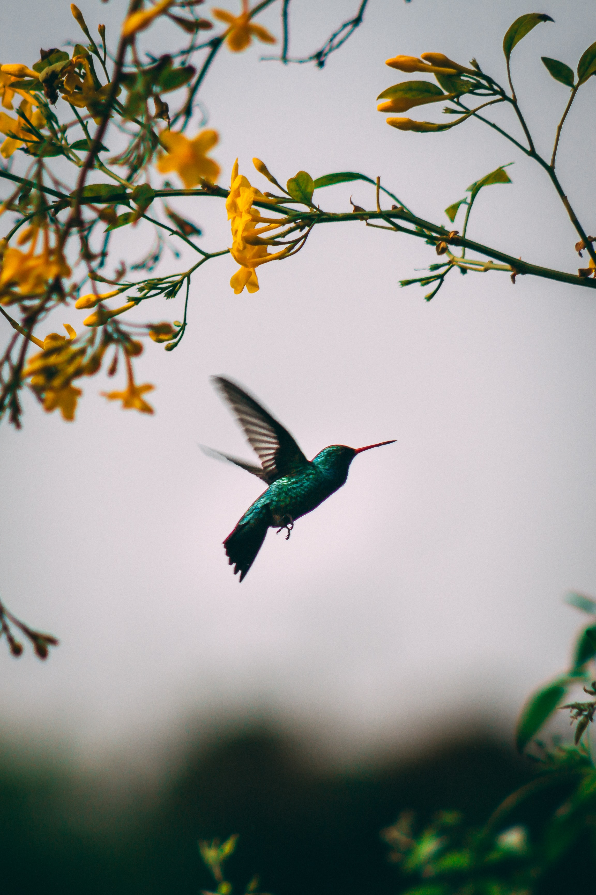
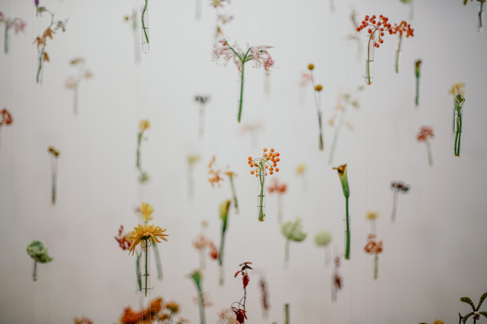

  

  
My doula practice blends the art of holding space and the science of our awe-inspiring bodies.

  
I am passionate about providing doula care that honours you, your family, and your birth. Everyone deserves to feel safe, supported, and empowered during pregnancy, childbirth, and onwards into parenthood.

  

  

  

    <figure>
      
    </figure>
  

  

I believe in the physiology of birth - that you, your body, and your baby instinctively know how to birth - and that you are the expert on your care. My goal is to help you feel educated about childbirth and all of your options, and confident and supported in your choices. I aim to create a safe and comfortable space for you to thrive in your birth and journey into new parenthood.

Before I trained as a doula, I studied neurobiology for ten years. From my time as a scientist I bring curiosity, critical thinking, and a love of research rabbit holes. I am fascinated by all aspects of birth, from the biological mysteries to the diversity of global birth practices. I strive to understand the history that shapes modern birth culture, and to be informed on the best evidence-based practices in perinatal care.

  

  

    <figure>
      
      <figcaption style="font-size:75%;">Geronimo Giqueaux on Unsplash</figcaption>
    </figure>
  

  

  

    
<b>Trainings & Education</b>

      <ul>
        <li>MotherWit Postpartum Doula Training (2020)</li>
        <li>Holistic Doula Program, Pacific Rim College (2019)</li>
        <li>BSc Neuroscience, McGill (2011)</li>
      </ul>
    
<b>Continued Learning</b>

      <ul>
        <li>CPR for Doulas, Safe Beginnings (2021)</li>
        <li>Supporting Neonatal Resuscitation, Safe Beginnings (2021)</li>
        <li>Abortion and miscarriage for doulas, Jessica Austin (2021)</li>
        <li>How to help families get evidence based care, Evidence Based Birth (2020)</li>
        </ul>

  

 
**Community Work**
* Board of directors, Doula Services Association of BC (2021-22)
* Postpartum volunteer, Vancouver Coastal Health’s CUDDLE program (2019)
* Big Sister, Big Sisters of the Lower Mainland (2014 - 2017)

 

<figure>
  
  <figcaption style="text-align:center;font-size:75%;">bady abbas on Unsplash</figcaption>
</figure>
