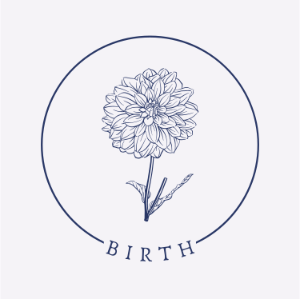
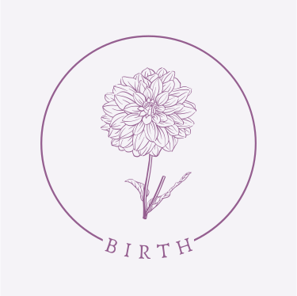
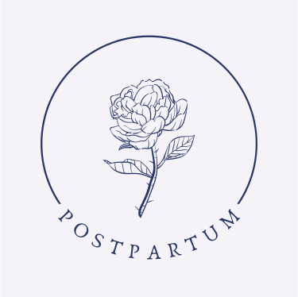
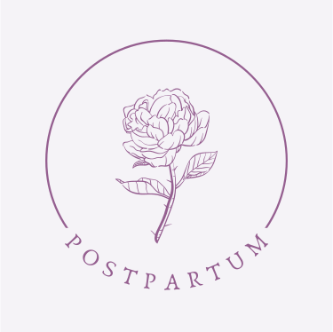
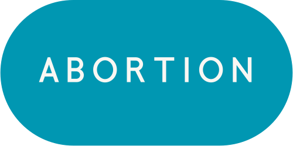
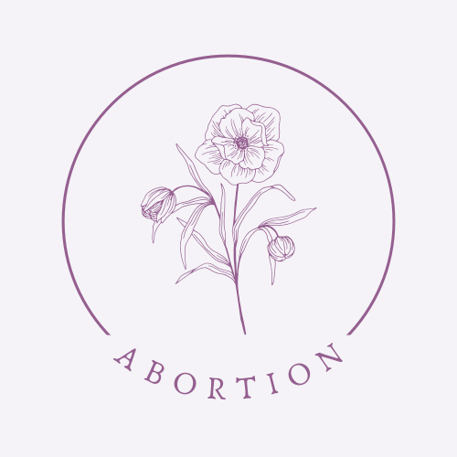

  

    

      
    

  

  

    

      
    

  

  

    

      
    

  

  
  
I am a doula on the wonderful <a href="https://ottawa.motherwit.ca/">MotherWit</a> team. We believe that...

  
  
Reach out for a complementary consultation, or join us on Zoom the first Wednesday of the month at 7PM for Meet the Doula night.

  
  
<a href="https://us02web.zoom.us/j/82678415366?pwd=K3VueVkwSjIxbzVDY1lJRnEvdWFHdz09&fbclid=IwAR12d1T1haSEX-7YB3xqXgEV8_iBdznj5zssvvN16_IvexSu2iJI-REXIvs">Join Zoom Meeting</a>
   Meeting ID: 826 7841 5366
   Passcode: 543093d

  

